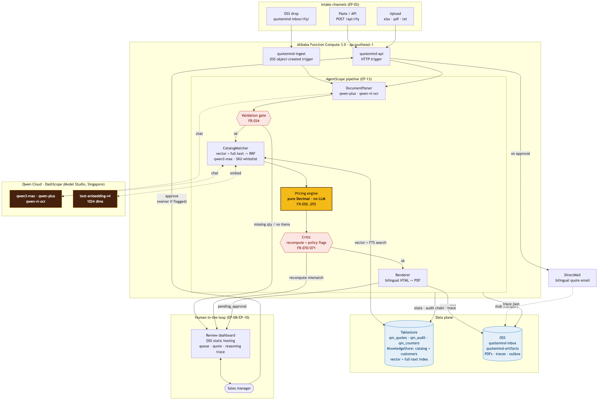

# QuoteMind architecture

Source: [`architecture.mmd`](architecture.mmd) · rebuild with `make diagrams`.

## The one idea

A quote is a document that a customer will be invoiced from. So the system is built around a single
constraint: **the language model is never allowed to do arithmetic.**

The model does what it is genuinely good at - reading a messy Vietnamese email, working out that
"20 con lap Dell i7 32GB" means twenty Latitude 5450 i7 laptops, and picking that SKU out of a
catalog of near-identical variants. Everything downstream of that is ordinary, boring,
unit-tested Python: `Decimal` prices, VAT bands, totals, amount-in-words. A separate critic then
recomputes the whole thing from the source data and refuses to pass a quote whose numbers do not
reconcile.

This is not a stylistic preference. We measured it. On 25 labelled RFQs, a single monolithic agent
given the same models and the same catalog extracted the line items just as well (F1 0.992) and
picked the right SKU almost as often (98%) - and got the **money wrong on 52% of quotes**, while
flagging the problem 0% of the time. Taking arithmetic away from the model and putting a critic
behind it is worth **+48 points of end-to-end task success**. The numbers are in
[`eval/reports/`](../eval/reports/).

## The pieces

**Qwen Cloud (DashScope, Singapore)** is the model gateway. `qwen-plus` parses RFQ text,
`qwen3-max` selects the SKU and plans, `qwen-vl-ocr` handles scans, and `text-embedding-v4` (1024
dims) powers catalog retrieval. Model ids are frozen constants; a cold-start probe verifies each
one and activates a documented fallback if Model Studio has retired it, reporting the substitution
on `/health` (TASK-012) rather than silently changing behaviour.

**Function Compute 3.0** runs two functions from one codebase. `quotemind-api` serves the HTTP API
and holds the approval gate; `quotemind-ingest` fires on an OSS object-created trigger when an RFQ
file lands in `quotemind-inbox/rfq/`. They share the same pipeline deliberately - an ingest path
with its own copy of the quoting logic would be a second system that could disagree with the first
about the price.

**Tablestore** is both the database and the agent's memory. `qm_quotes` / `qm_audit` /
`qm_counters` hold durable quote state, a hash-chained audit trail, and the atomic per-year quote
counter. The KnowledgeStore holds the catalog and customers with a vector + full-text index, which
is what makes hybrid retrieval (RRF fusion of semantic and keyword hits) possible in one store.

**OSS** holds the RFQ inbox, the rendered quote PDFs, the persisted reasoning traces, and the stub
outbox. Objects are private; the dashboard and the quote email reach them through short-lived
V4-presigned URLs.

**The dashboard** is a single static file on OSS static hosting. It shows the queue, the quote, and
the full reasoning trace - every model call, tool call and memory read, with its tokens, cost and
duration.

## The two gates that make it safe to automate

**The validation gate (TASK-034).** If the extraction is missing a quantity or has no line items, the
pipeline stops *before* matching. It does not guess. A quote with an invented quantity is worse than
no quote.

**The human gate (TASK-080/083).** No quote is ever sent automatically. The pipeline runs to
`pending_approval` and stops - durably, in Tablestore, so a completely different process can pick it
up. The critic's blocking flags (a margin under the floor, a recompute mismatch) cannot be approved
away silently: approving one requires an explicit waiver, and the waiver is written verbatim into
the hash-chained audit trail alongside who did it and why.

The human gate is the feature, not the limitation. This is a system that decides what to do, and
then asks.
